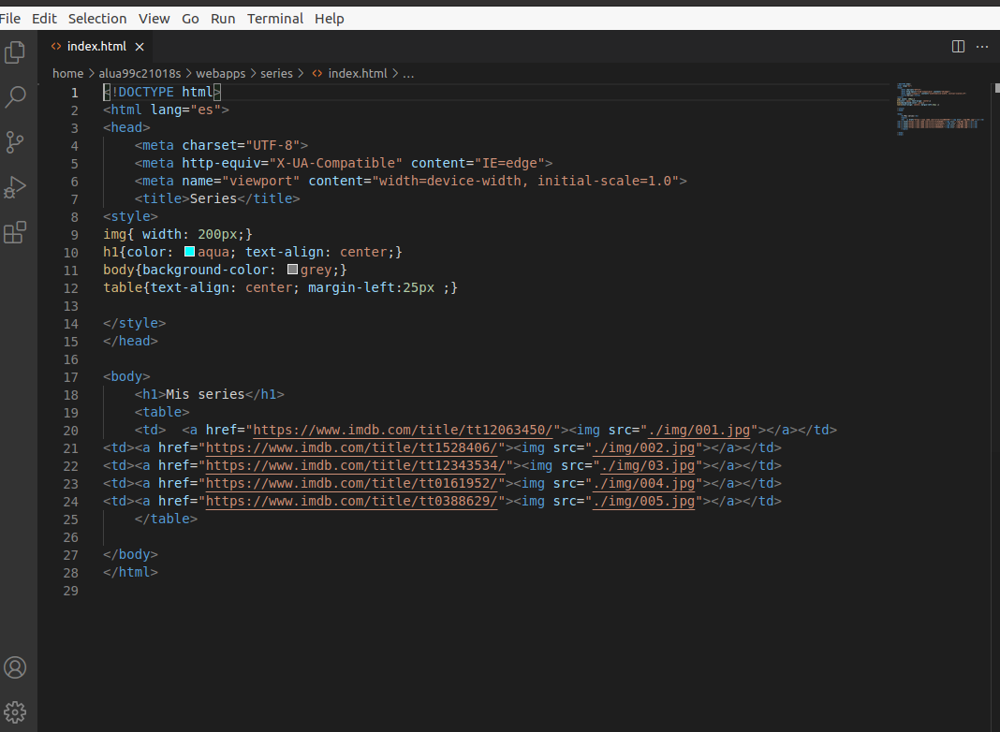
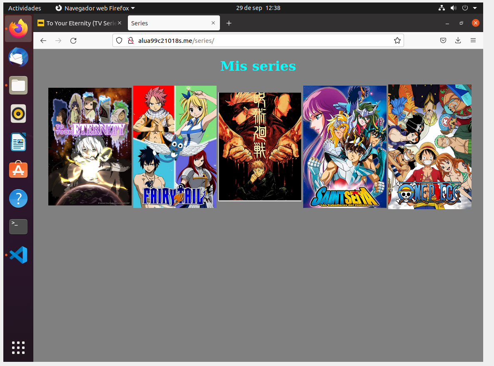

## Mis series favoritas.

La actividad consiste en crear una página web que nos enlace a tus 5 series favoritas.

#Objetivos de la practica.
La página debe abrirse al acceder a http://alua99c21018s.me/series/
Poner las portadas de las series, no los nombres.
Los enlaces de las portadas de las series deben ir a su correspondiente página dentro de IMDB
La página hay que editarla directamente en la máquina de producción, accediendo por ssh y utilizando un editor en consola (nano, vi, ...)
Ubicar el index.html en $HOME/webapps/series.

Haciendo uso de Nginx, que hemos instalado previamente, y una carpeta de la siguiente manera /HOME/alua99c21018s/webapps
antes de empezar para agilizar crearemos una carpeta dentro de webapps.
~~~
mkdir /home/alua99c21018s/webapps/series
~~~

Tras eso, iremos a la carpeta
~~~
/etc/Nginx/sites-available
~~~
Dentro de este directorio crearemos el fichero, alua99c21018s.me, en el crearemos la siguiente estructura.

~~~
server{
  server_name alua99c21018s.me;
  location /series{
    root /home/alua99c21018s/webapps/;
  }
}
~~~
Con esto hemos definido el nombre del servidor y la *location* para definir la ruta.

Tras esto solo nos queda crear un enlace simbolico a la carpeta *sites-enable* ubicada en la misma carpeta de *Nginx*
para ello primero iremos a la carpeta enable y
~~~
sudo ln -s ../sites-available/alua99c21018s.me
~~~
Con esto crearemos un enlace del fichero anterior.
Para continuar, actualizaremos Nginx, iremos a la carpeta de *webapps/series* y en el crearemos una carpeta para imagenes y otra para un *index.html*.
Crearemos un index haciendo uso de los enlaces con imagenes y le daremos algo de estilo para que no quede muy soso.

> Aclaración, se pidio permiso al profesor para usar visual studio para dar estilo y una mejor estructura al trabajo

Al terminar, iremos a hosts y añadiremos el nuevo servidor y finalmente comprobaremos

