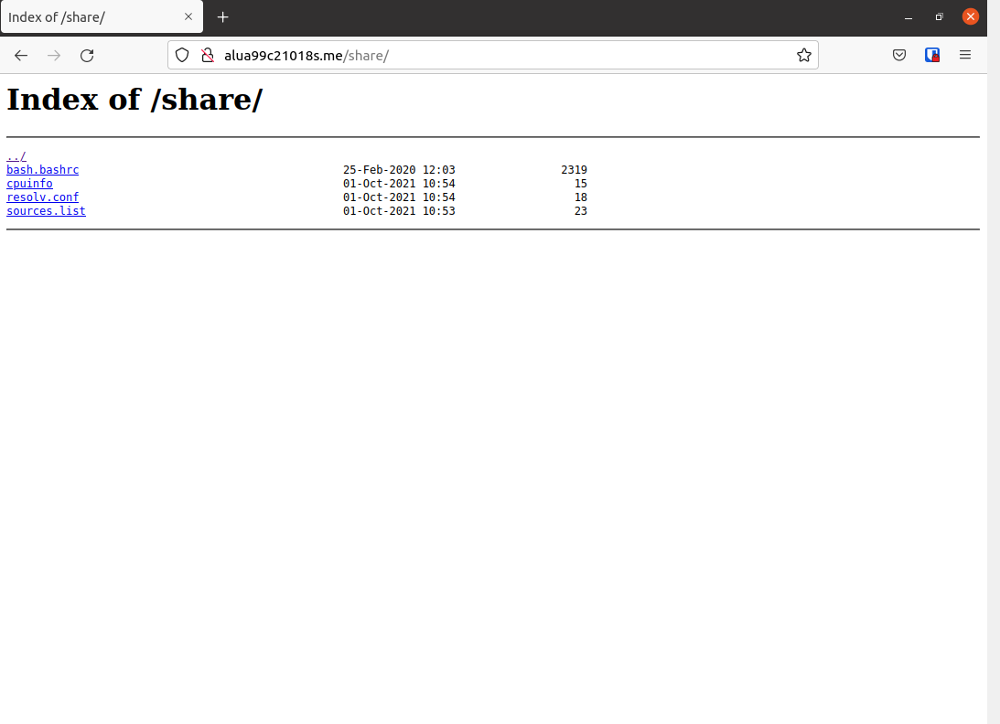

## Listados de directorios

La actividad consiste en crear una página web en la que veremos con autoindex varios elementos del sistema operativo.
# Objetivos
Se debe acceder al listado al entrar en http://aluXXXX.me/shared/

El listado debe contener los siguientes ficheros:

/etc/apt/sources.list (repositorios de paquetes)

/etc/resolv.conf (listado de DNS)

/etc/bash.bashrc (configuración global de bash)

/proc/cpuinfo (características de la máquina)

>Nota: me equivoque en una letra cuando cree la carpeta shared por lo que en vez de abrirse con shared se abre con share.

Haciendo uso de Nginx y el directorio webapps. Al igual que en la practica anterior, antes de empezar para agilizar crearemos una carpeta dentro de webapps, en este caso crearemos una con el nombre *share*.

Dentro de esta carpeta crearemos enlaces simbolicos de   
*/etc/apt/sources.list*  
*/etc/resolv.conf*  
*/etc/bash.bashrc*  
*/proc/cpuinfo*

Para ello usaremos el siguiente comando:

~~~
ln -s /etc/apt/sources.list  
ln -s /etc/resolv.conf  
ln -s /etc/bash.bashrc  
ln -s /proc/cpuinfo
~~~~
Continuando, iremos a la carpeta *sites-available*, encontrada en */etc/Nginx*, en ella editaremos el fichero alua99c21018s de la siguiente manera.

~~~
location /share{
  root /home/alua99c21018s/webapps/;
  autoindex on;
}
~~~
Como podemos ver no hace falta añadir *server_name*, ya que lo añadimos en la practica anterior y como se puede ver he agregado un autoindex para que me genere automaticamente un index con lo que este dentro de la carpeta que haya elegido como root.

finalmente reiniciamos el servicio y comprobamos.

