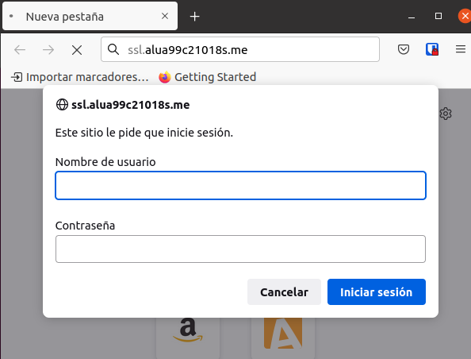

# trabajo con virtual Host

## Sitio web 1
http://imw.aluXXXX.me    
Debe mostrar una página con la imagen del "Diagrama de unidades de trabajo" de IMW":   
La imagen no debe ser enlazada en remoto, sino  que se debe descargar al directorio de trabajo en la máquina de producción, y luego usar un tag  apuntando a la ruta local.  

Haciendo uso de Nginx y el directorio webapps, en esta segunda, crearemos un directorio con el nombre *imw*.   

~~~
mkdir /home/alua99c21018s/webapps/imw
~~~

Luego iremos a la carpeta */etc/Nginx/sites-available* y crearemos un fichero

~~~
nano imw.alua99c21018s.me
~~~
y dentro de este, le daremos la siguiente configuración:

~~~
server{
server_name imw.alua99c21018s.me;
root /home/alua99c21018s/webapps/imw;
}
~~~
Al terminar, iremos a la carpeta *sites-enabled* y crearemos un enlace simbolico de la nueva carpeta. Despues iremos a la carpeta previamente creada. En el crearemos un subdirectorio que llamaremos *img* y crearemos un ***.html***. En el insertaremos una imagen usando una ruta local
~~~

~~~
Luego iremos al fichero *hosts*, en el que añadiremos el nuevo sitio web, reiniciaremos el servicio y comprobaremos.

### Sitio web 1.2
http://imw.aluXXXX.me/mec/    
No utilizar un location.    
Debe mostrar una página con un enlace al Real decreto del título de Administración de Sistemas Informáticos en Red - MEC (ver moodle de la asignatura).

En la carpeta que creamos "*imw*" crearemos otra carpeta, con el nombre *mec*, iremos a la carpeta de Nginx *sites-available* y dentro del anterior fichero añadiremos lo siguiente.

~~~
server{
server_name imw.alua99c21018s.me;
root /home/alua99c21018s/webapps/imw;
}

server{
  server_name imw.alua99c21018s.me/mec;
  root /home/alua99c21018s/webapps/imw/mec;
}
~~~
Como podemos ver no se ha creado un *location* si no un nuevo servicio. Al terminar guardaremos los cambios e iremos a la carpeta ***/webapps/imw/mec***, en el crearemos un **.html** En el que añadiremos lo siguiente.
~~~
<a href="https://acortar.link/HcEKj">admin-sist-Informáticos-red</a>

~~~
>el enlace puesto lleva a la pagina esta acortado.

Al igual que antes haremos los pasos pertinentes(reiniciar el servicio etc...) y probamos.

   

## Sitio web 2
http://varlib.aluXXXX.me:9000
Debe mostrar el listado de ficheros y directorios de /var/lib de la máquina de producción.     
Pensar qué root definir para conseguir el objetivo planteado.

En este caso, como no tenemos que crear nada, iremos directamente a *sites-available* y en el crearemos un fichero con el nombre *varlib.alua99c21018s.me* y le daremos la siguiente estructura.

~~~
server{
server_name varlib.alua99c21018s.me;
root /var/lib;
autoindex on;
}
~~~
Como se puede ver hay un elemento especial, llamado **autoindex**, Esto permitira que, al entrar en la ruta *var/lib/* cree un index con el contenido del directorio. Para acabar actualizaremos el servicio y lo añadiremos a la carpeta *hosts* y probamos.

## Sitio web 3
http://ssl.aluXXX.me/students/
Debe pedir usuario/clave. Los datos son:
USUARIO: usuario1
CLAVE: 2asir
Debe mostrar una página web con el nombre de todo el alumnado de clase.
Se debe prohibir explícitamente el acceso al fichero htpasswd

Iremos a la carpeta *webapps* y en ella crearemos una carpeta llamada students, en ella realizaremos algunos pasos previos. En primer lugar tendremos que generar el fichero *.htpasswd* Este fichero tiene una estructura en el que cada línea
identifica a un posible usuario en la forma:

~~~
username:encrypted-password:comment
~~~
Para generar un password, introduciremos el siguiente codigo.

Con esto hemos generado un token, copiaremos ese token y modificaremos el *.htpasswd*
añadiendo lo siguiente:

~~~
usuario1:fePQDifyQ69lo
~~~
Con esto hemos definido el usuario.

Ahora iremos a *sites-available* y crearemos un fichero llamado **ssl.alua99c21018s.me** en el que definiremos:
~~~
server {
 server_name ssl.alua99c21018s.me;
 root /home/alua99c21018s/webapps/students;
 auth_basic "Restricted Access";
 auth_basic_user_file /home/alua99c21018s/webapps/students/.htpasswd;
 location /students/.htpasswd {
 return 403;
 }
}
~~~
Con esto hemos definido que queremos un usuario que esta alojado en el fichero anterior y con el location hemos definido que si alguien entra a ese *location* le de error.
Terminaremos haciendo los pasos pertinentes y comprobamos.

##Sitio web 4
http://redirect.aluXXXX.me

Se debe redirigir cualquier petición de este dominio a http://target.aluXXXX.me

http://redirect.aluXXXX.me/test/ -> http://target.aluXXXX.me     
http://redirect.aluXXXX.me/probando/ -> http://target.aluXXXX.me     
http://redirect.aluXXXX.me/hola/ -> http://target.aluXXXX.me   

Al acceder a http://target.aluXXXX.me se debe mostrar la página web que se adjunta en el archivo initializr-verekia-4.0.zip.

Crearemos una carpeta llamada *target* en la carpeta de *webapps* en el descomprimimos el archivo que nos ha dado el profesor y dejamos todo en esa carpeta, iremos a *sites-available* de Nginx y crearemos el fichero target.alua99c21018s.me y en el crearemos la siguiente configuración.

~~~~
server {
 server_name target.alua99c21018s.me;
 root /home/alua99c21018s/webapps/target;
server {
 listen 80;
 server_name redirect.alua99c21018s.me/probamos;
 return 301 http://target.alua99c21018s.me;
}
server {
 listen 80;
 server_name redirect.alua99c21018s.me/hola;
 return 301 http://target.alua99c21018s.me;
}
server {
 listen 80;
 server_name redirect.alua99c21018s.me/test;
 return 301 http://target.alua99c21018s.me;
}
~~~~
Guardamos, hacemos los enlaces correspondientes y comprobamos 

