# Sirviendo aplicaciones Php y Python

La actividad consiste en configurar 2 sitios web (virtual hosts) en nuestro servidor web Nginx, con las siguientes características.

##  Sitio web 1
http://php.aluXXXX.me         
Mostrar la aplicación demo_php.zip que se adjunta.

Primero crearemos un directorio llamado PHP en la carpeta webapps, alojado en nuestro *Home* de nuestra maquina.
~~~
mkdir /home/imwalua99c21018s.me/webapps/php
~~~
Dentro del directorio php, añadiremos el contenido del archivo de **demo_php**.
Para continuar iremos a la carpeta
~~~
/etc/Nginx/sites-available
~~~
Crearemos en fichero llamado **php.alua99c21018s.me** y en el añadiremos lo siguiente.
~~~
server{
  server_name php.alua99c21018s.me;
  root/home/imwalua99c21018s/webapps/php;
  index index.php;
  location ~ \.php{
            include snippets/fastcgi-php.conf;
            fastcgi_pass unix:/run/php/php7.4-fpm.sock;
  }
}
~~~
Con el location anteriormente definido le decimos a la maquina que funcione el PHP.
Luego iremos a la carpeta *sites-enable* crearemos un enlace simbolico del fichero anterior.

~~~
ln -s ../sites-available/php.alua99c21018s.me
~~~
al terminar reiniciamos el servicio y finalmente comprobamos.

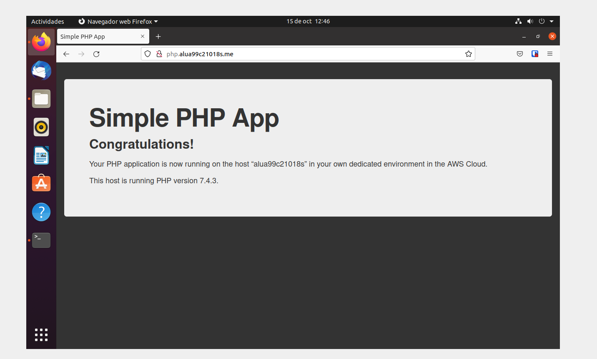

## Sitio web 2
http://now.aluXXXX.me
Usaremos un programa de python que esta en el campus.

Antes de empezar instalaremos la última versión Python disponible para el sistema

~~~
sudo apt install -y python3.8
~~~
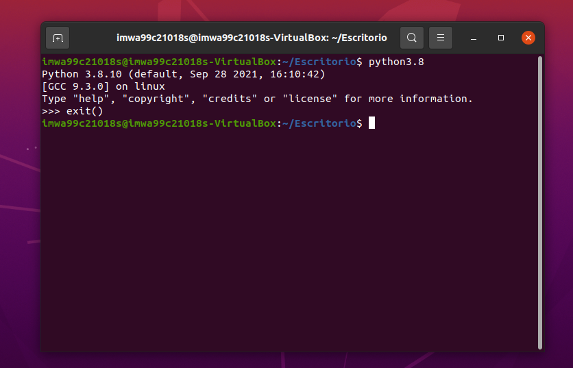

> En el esta ultima captura, vemos la version de python.

Instalaremos gcc ya que necesitamos un compilador de C:

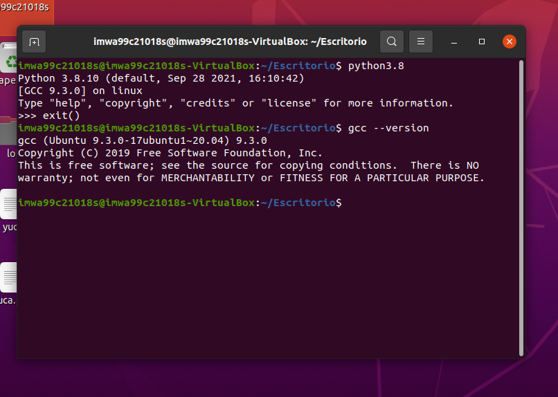

En el home crearemos un directorio que llamaremos tmp. Entraremos y ejecutaremos el programa curl para instalar el paquete pip.

 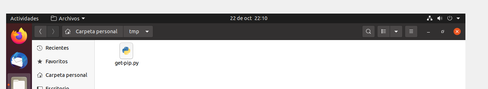

 Luego en el archivo .bashrc añadiremos el siguiente programa.

 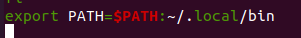

Ahora, crearemos en la carpeta de webapps alojada en home, que llamaremos now.

Dentro del nuevo directorio abriremos un terminal y crearemos un entorno virtual
~~~
pipenv install
~~~

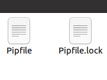

Ahora instalaremos **uWSGI**, el encargado de procesar las peticiones *http* para aplicaciones con código python.

~~~
sudo -H pip install uwsgi
~~~

Ahora instalaremos un "mini-framework" de desarrollo web.
>Un entorno de trabajo (del inglés framework), o marco de trabajo​ es un conjunto estandarizado de conceptos, prácticas y criterios para enfocar un tipo de problemática particular que sirve como referencia, para enfrentar y resolver nuevos problemas de índole similar.

~~~
pipenv install flask
~~~
Ahora creamos un fichero llamado main.py con el siguiente contenido:

~~~
import datetime
import pytz
from flask import Flask
app = Flask(__name__)

@app.route('/')
def hello():
    now = datetime.datetime.now(pytz.timezone("Atlantic/Canary"))
    return '''
    <h1>Testing Python over Nginx</h1>
    <h2>In Canary Islands...</h2>
    Today is: {today}
     
    Now is: {now}
    '''.format(
        today=now.strftime('%d/%m/%Y'),
        now=now.strftime('%H:%Mh')
    )
~~~
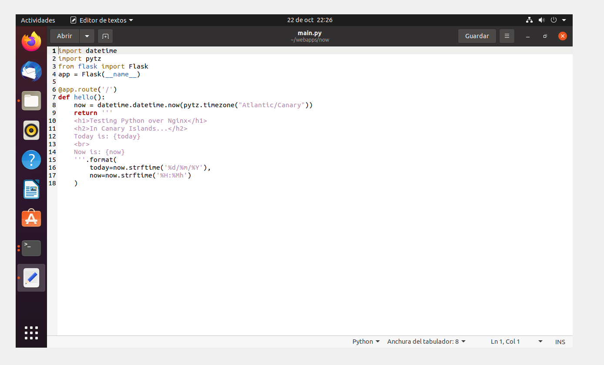

y crearemos run.sh.
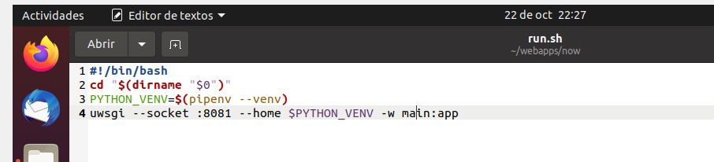

Iremos a la carpeta:
~~~
 /etc/nginx/sites-available

~~~
Y crearemos el fichero now.alua99c21018s.me
con el siguiente:
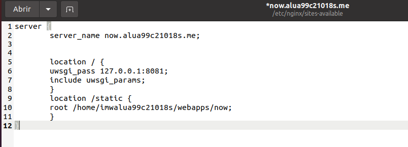

Luego iremos a la carpeta *sites-enable* crearemos un enlace simbolico del fichero anterior.

~~~
ln -s ../sites-available/now.alua99c21018s.me
~~~
Reiniciamos nginx.
Iremos de nuevo a la carpeta *now* y ejecutaremos el run.sh y comprobaremos.
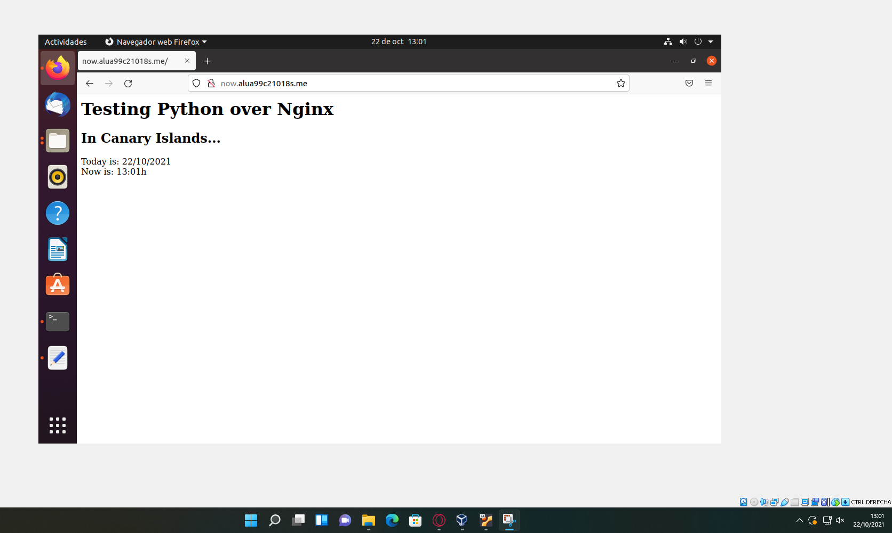.

Ahora usaremos supervisor, lo instalaremos.

~~~
sudo apt install -y supervisor
~~~

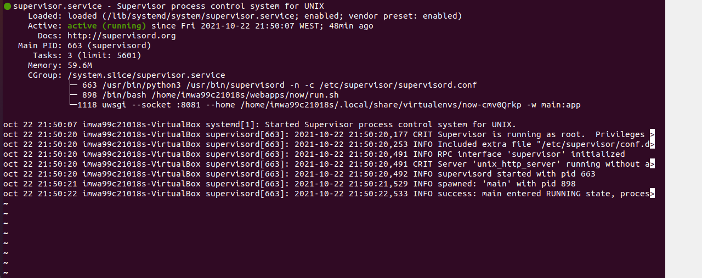

Ahora le daremos permisos necesarios y para acabar usaremos los siguientes comandos descritos en la practica.

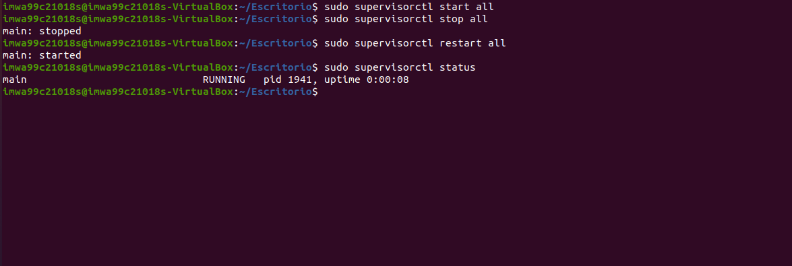
