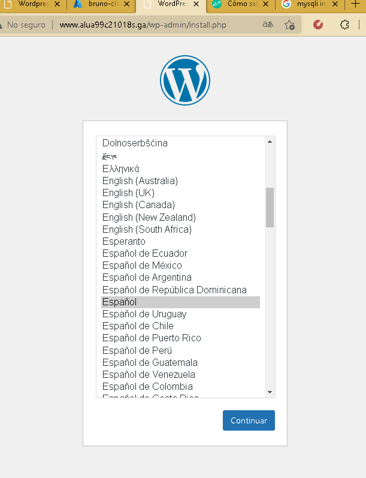
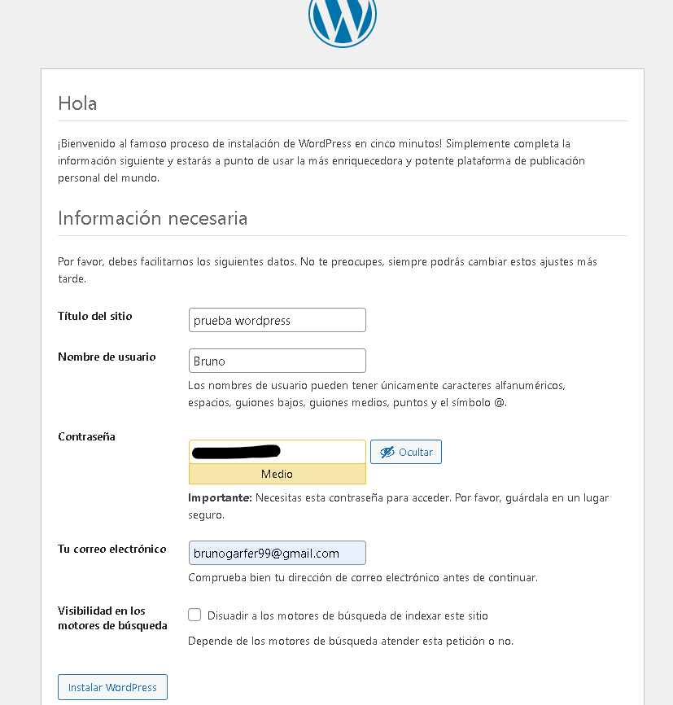
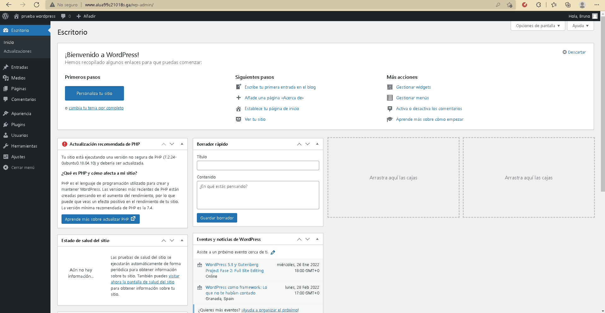
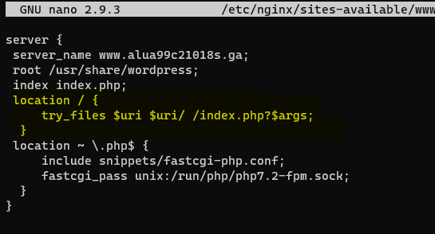
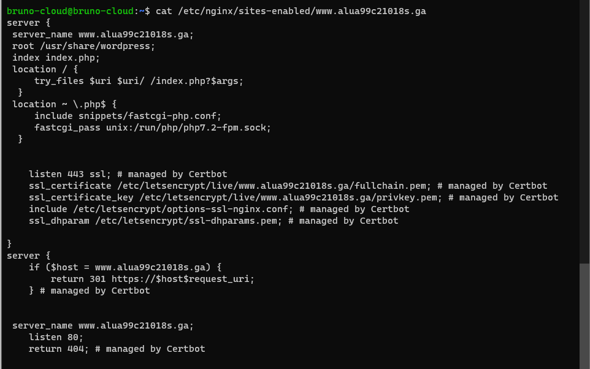
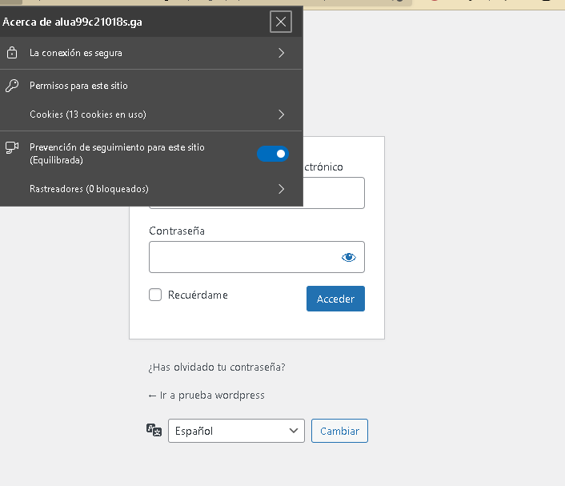
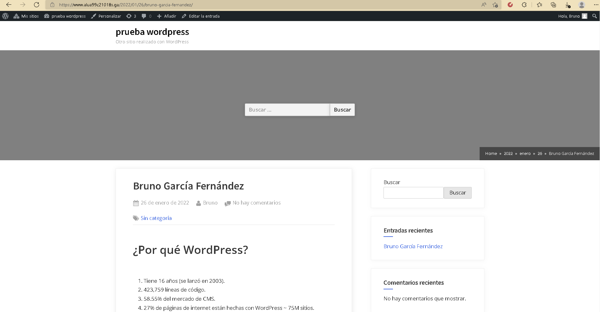

# Wordpress

- ***Nombre:*** Bruno García Fernández
- ***Curso:*** 2º de Ciclo Superior de Administración de Sistemas Informáticos en Red.

### ÍNDICE
+ [Introducción](#id1)
+ [Objetivos](#id2)
+ [Material empleado](#id3)
+ [Desarrollo](#id4)
+ [Conclusiones](#id5)

#### ***Introducción***.

WordPress es un sistema de gestión de contenidos lanzado el 27 de mayo de 2003, enfocado a la creación de cualquier tipo de página web. Originalmente alcanzó una gran popularidad en la creación de blogs, para luego convertirse en una de las principales herramientas para la creación de páginas web comerciales.

#### ***Objetivos***.

+ Realizar la instalación de Wordpress en el dominio wordpress.aluXXXX.me.
+ Instalar y activar un tema gratuito.
+ Ajustar los permalinks a Día y Nombre.
+ Escribir un post con las estadísticas de uso de Wordpress vistas en clase y entrar a dicho post.

#### ***Material empleado***.

+ Máquina de Azure

#### ***Desarrollo***.

Para empezar, entraremos en MYSql y crearemos una base de datos, un usuario y a este usuario le daremos privilegios totales en la base de datos.

Luego iremos a `tmp` y en el descargaremos el ".zip" de la pagina de wordpress. Para descargarlo usaremos el siguiente comando:
~~~
curl -O https://wordpress.org/latest.zip
~~~

A continuación lo descomprimimos y lo copiamos en `/usr/share` para ello usamos este comando:

~~~
unzip latest.zip
sudo cp -r wordpress /usr/share
~~~

Ahora damos permisos para que el usuario web pueda usar los archivos:
~~~
sudo chown -R www-data:www-data /usr/share/wordpress/
~~~
En la carpeta de WordPress iremos al config.php de WordPress y añadiremos lo anteriormente creado en MYSql;
~~~
...
// ** MySQL settings - You can get this info from your web host ** //
/** The name of the database for WordPress */
define('DB_NAME', 'wpdatabase');
/** MySQL database username */
define('DB_USER', 'wpuser');
/** MySQL database password */
define('DB_PASSWORD', 'Testing_1234');
/** MySQL hostname */
define('DB_HOST', 'localhost');
/** Database Charset to use in creating database tables. */
define('DB_CHARSET', 'utf8mb4');
/** The Database Collate type. Don't change this if in doubt. */
define('DB_COLLATE', '');
...
~~~

En NGINX creamos el sitio web (el sitio web en mi caso se llama www.alua99c21018s.ga)

En el archivo del sitio web introducimos...

~~~
server {
 server_name www.alua99c21018s.ga;
 root /usr/share/wordpress;
 index index.php;
 location ~ \.php$ {
 include snippets/fastcgi-php.conf;
 fastcgi_pass unix:/run/php/php7.2-fpm.sock;
 }
}
~~~

> Mi versión de PHP es la versión 7.2.

Luego como en prácticas anteriores haremos el enlace simbólico en /sites-enabled, y reiniciamos Nginx, si todo ha ido como debería, al entrar en `www.alua99c21018s.ga` deberiamos ver la siguiente pantalla.

Ahora viene la creación del titulo del sitio, nombre de usuario, contraseñas...

AL terminar veremos el siguiente panel de control.

Ajustaremos los permalinks con día y Nombre

Tras cambiarlo para que los cambios surgan efecto deberemos añadir lo siguiente en el sitio de nginx.

Ahora lanzaremos el certbot para que el de manera automática nos provea de un certificado.

Al terminar el bot podremos ver en el archivo del sitio la configuración que ha creado el certbot.

También podremos comprobarlo en el navegador.

Luego entraremos y crearemos una nueva entrada, en ella ajustaremos los permalinks de dia y Nombre y crearemos un post.

 

#### ***Conclusiones***.
WordPress es un sistema de gestión increíble funciona muy bien y te permite crear paginas web en nada.
